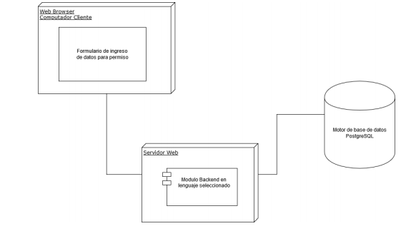
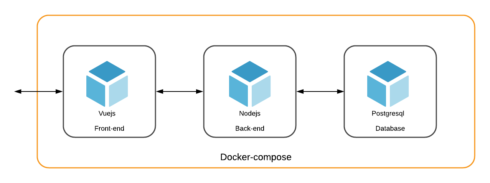

# Pep 1 Sistemas distribuidos

Por:

- Vicente Vega Toro

## Contexto

La pandemia restringe la movilidad de las personas, esto debido a que se debe cumplir una cuarentena para que la enfermedad no se propague. Es así que para transistar en cualquier lugar publico es de suma importancia requerir de un permiso de movilidad.

Estos permisos son entregados de manera online a traves de la página [comisariavirtual.cl](https://comisariavirtual.cl/), los cuales tienen ciertos motivos. Todo con la finalidad de probar, en caso de fiscalización, la legalidad de transitar en sectores públicos.

## Evaluación

Como se menciona anteriormente, los permisos son entregados de manera online, por lo que se pide simular una arquitectura que permita realizar permisos de circulación. El sistema web debe estar realizado de la siguiente manera.

Ademas, se debe analizar las caracteristicas visto en clases de los sistemas distribuidos, indicando cuales cumple y cuales no.

## Tecnologias

Para la realizacion de esta prueba se utilizaron las siguientes tecnologias:

- Frontend: Vue.js
- Backend: node.js
- DB: postgresql

Cabe destacar que tambien se utilizo **Docker-compose** para la implementacion de la pagina web, por lo que cada parte de la arquitectura (Frontend, Backend y DB), están en un Docker.

Finalmente, la arquitectura resultante del sistema es el siguiente. 

## Iniciar

Como se menciono anteriormente, al utilizar **Docker-compose** solo se necesita utilizar el comando *Docker-compose up* en la carpeta del proyecto para que este funcione.

## Caracteristicas de los sistemas distribuidos

A continuación se listan las caracteristicas de los sistemas distribuidos y se indica si lo aplicado cumple o no con la caracteristica.

|Caracteristica|Descripcion|¿Lo poseé el sistema?|
|--------------|-----------|---------------------|
|Escalabilidad|Un sistema es escalable si el aumento de servicios se puede suplir dinamicamente, es decir, el sistema es capaz de aumentar o disminuir la cantidad de recursos segun lo que se demande. Este puede ser horizontal, donde se agregan más recursos, o vertical, donde se aumentan las capacidades de los recursos.|El sistema actualmente no es escalable, debido a que no puede disminuir o aumentar sus recursos según la demanda. No se implementa caché, por lo que no se puede buscar rapidamente la respuesta a algunas consultas, tampoco particiones por lo que no se puede distribuir las consultas. Es asi que se pueden generar cuellos de botella si es que se envian muchas consultas.|
|Transparencia|Corresponde al hacer creer al usuario y las aplicaciones que el sistema web esta corriendo en una sola maquina y no que los procesos y recursos estan distribuidos en varias maquinas.|Actualmente el sistema solo corre en una maquina y no en diversas, por lo que el sistema no se puede considerar transparente. Ademas, al utilizar docker este solo corre en la maquina actual, por lo que no hay una distribucion de trabajo.|
|Disponibilidad|Se refiere a facilitar a los usuarios y aplicaciones acceder a recursos remotos de manera eficiente. Esto con objetivos economicos, ya que los usuarios no deberian tener un gran computador para acceder al servicio.| -- |
|Apertura|Indica que el sistema puede ser extendido facilmente a traves de reglas estandar que facilitan la comunicacion entre componentes. Esto puede ser de hardware y software. Se mide a traves de lo facil que se puede integrar un nuevo servicio sin perjudicar o duplicar los existentes.| Este sistema cumple con esta condición debido a que el estandar utilizado para comunicar los componentes (Back-end y Front-end) es hecho a través del estandar API REST |

## Pruebas y resultados

Para la realización de pruebas se utiliza usando el software [artillery.js](https://artillery.io/). 